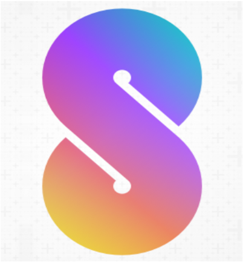

# 
   We     Share  

WeShare, an facebook and instagram clone with MERN Stack, allowing users to post images or videos, leave comments, like / save posts, send text message, and make video / voice calls. Technologies include: WebRTC, Socket.IO, MongoDB, Mongoose, Express.js, React, Redux, Node.js, HTML5, CSS, JavaScript, Bootstrap 4, Webpack, Heroku, Git, and Github.

# 
 [Check Out the Live App!][1] 

[1]: https://we-share2021.herokuapp.com/#/